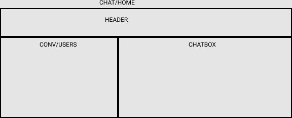

# Chat App Proof of concept 3-9-22

## Technical Requirements

### User/Auth

- Get all users except current
- Register with JWT
- Login with JWT
- Password encryption

### Messages/Conversations

- Get Global Messages
- Add a Single Global Message
- Get Conversations
- Add a Private Message
- Get a Private Message

## Front End Components

- Home
- Login
- Register
- Chat
- Chat Box
- Conversations
- Users
- Header

## Wireframe

## Improvements Needed

- More Static testing, Typescript
- Security, such as protection against cross site scripting. NoSql injections, param pollution. Potentially add rate limiter and header security(helmet)
- Deployment and Build Process CI/CD
- 2 factor auth
- Add Roles, like admin, user etc
- Ability to upload photos or code snippets
- Emoji and GIF support

## Additional Feature Ideas

- Pagination
- Query Params for Sorting and Filtering
- Selections
- Ability to delete and edit messages
- Dark Mode
- Auditing depending on permissions
