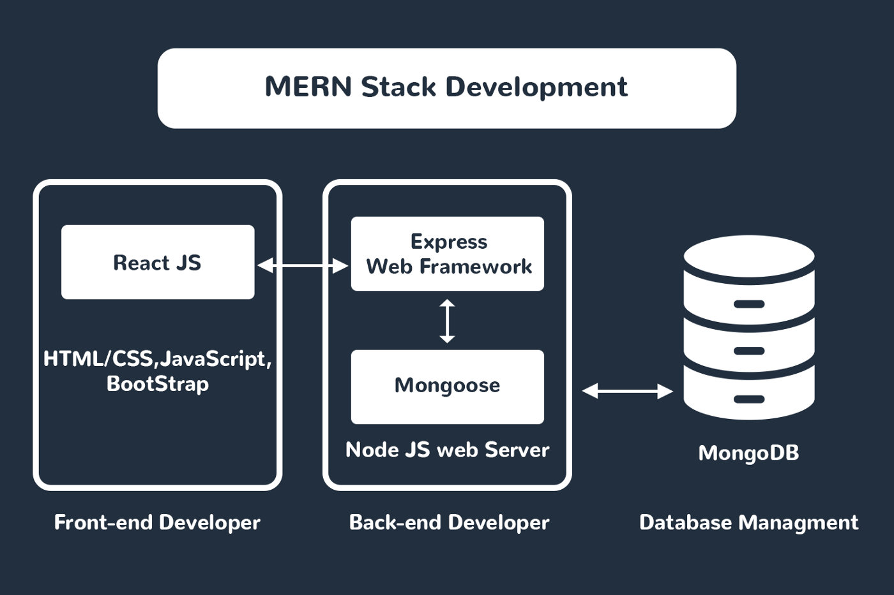

# MERN Chat

- :white_check_mark: App has users
- :white_check_mark: App has conversations
- :white_check_mark: App has messages
- :white_check_mark: Messages are associated with a user and a conversation
- :white_check_mark: Messages have a timestamp
- :white_check_mark: Conversations have participant (users) and messages
- :white_check_mark: Users are participants in conversations, they can send and receive messages
- :white_check_mark: API supports getting a list of conversations that could be consumed by a UI
- :white_check_mark: API supports sending/receiving messages

  
Frontend is built with [Material UI](https://material-ui.com/) running on top of React.
The backend is built with Express.js and Node.js.
Real-time message broadcasting is developed using [Socket.IO](https://socket.io/).

### Features

- Authentication using **JWT Tokens**
- A **Global Chat** which can be used by anyone using the application to broadcast messages to everyone else.
- A **Private Chat** functionality where users can chat with other users privately.
- Real-time updates to the user list, conversation list, and conversation messages

### How to use

1. Clone this repo
2. Once you have the repo, you need to install its dependencies. So using a terminal, move into the root directory of the project and execute `npm install` to install the dependencies of the Node.js server and then run `npm run client-install` to install the dependencies of the frontend.
3. This application uses MongoDB as its Database. So make sure you have it installed. You will need a connection string from the DB you create.
4. To run, execute `npm run dev`. If this command fails, try installing the package [concurrently](https://www.npmjs.com/package/concurrently) globally by running `npm install -g concurrently` and then running the `dev` command.
5. The frontend of the application will automatically open in your web browser.

### Things to note

- The frontend is created using [create-react-app](https://github.com/facebook/create-react-app)
- Database connections in the backend are handled using the [Mongoose ORM](https://mongoosejs.com/)
- Code quality is ensured using (ESLint)[https://eslint.org/]
